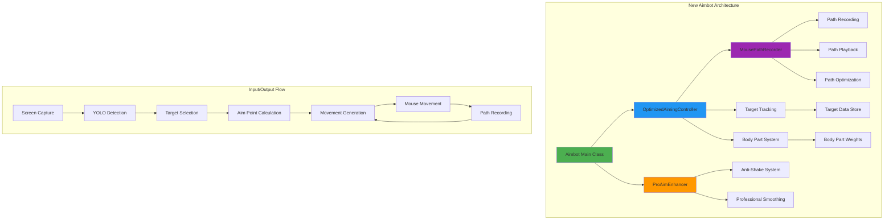

# Lunar-Remastered-AI-Aimbot-for-Linux
I'm MelvinSGjr, the first(?) creator of [ai aimbot for linux](https://github.com/MelvinSGjr/Lunar-AI-Aimbot-for-Linux/tree/main), I have lost access to aupload anything on my previous account, so I made a new one

## Key Differences Summary:

### **1. Architecture & Modularity**
- **New `aimbot.py`**: Modular OOP design with separate classes:
  - `MousePathRecorder` - Records and replays mouse paths
  - `OptimizedAimingController` - Handles aiming logic
  - `ProAimEnhancer` - Adds professional aiming techniques
  - `Aimbot` - Main orchestrator
- **Old `aimbot (copy).py`**: Single monolithic class with mixed responsibilities

### **2. Aiming Philosophy**
- **New**: "Your style + Pro enhancement" - Keeps your natural aiming style while adding professional techniques
- **Old**: Complex learning system with pattern matching and adaptive parameters

### **3. Movement System**
- **New**: Records and replays YOUR actual mouse movements for natural-looking aim
- **Old**: Calculates movements based on mathematical formulas and learned patterns

### **4. Speed & Performance**
- **New**: Optimized for 240 FPS with minimal processing overhead
- **Old**: Variable FPS with complex calculations

### **5. Key Features Missing in New Version**
- Learning system with pattern matching
- Accuracy statistics tracking
- Trigger bot functionality
- Target trajectory prediction
- Player profile system
- Overshoot detection and correction

### **6. Key Features in New Version**
- Anti-shake system to prevent micro-jitter
- Professional aiming enhancement (donk-inspired)
- Mouse path recording/playback
- Faster response times (~15ms target)
- Smoother transitions between body parts

## Architecture Diagram:

## Migration Path (Old → New):
The new version simplifies the architecture but loses some useless features.

1. **No stats accuracy** the accuracy statistics tracking
2. **No integrate that does not works** the learning system for parameter adjustment
3. **What I added** the professional enhancement and anti-shake systems
4. **Maintain** the new mouse path recording system

The new architecture is cleaner and faster, but the old version had more sophisticated learning capabilities that almost looks useless.
